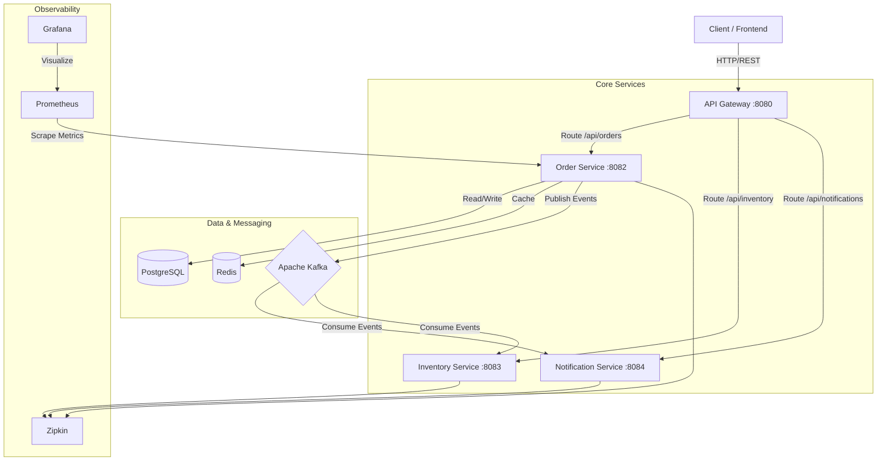

# 🚀 Order Management System - A to Z Explanation

## 1. Project Overview
**"What is this project?"**
This is a robust, scalable **Microservices-based Order Management System**. It is designed to handle high-volume e-commerce operations, allowing users to place orders, track their status, and manage inventory in real-time.

**Key Value Proposition:**
Unlike a monolithic app, this system is decoupled. If the Notification service goes down, people can still place orders. If traffic spikes, we can scale just the Order Service.

---

## 2. High-Level Architecture
The system follows an **Event-Driven Microservices Architecture**.

---

## 3. Technology Stack & "Why?"

| Technology | Purpose | Why I chose it? |
| :--- | :--- | :--- |
| **Spring Boot 3** | Backend Framework | Industry standard, rapid development, great ecosystem. |
| **Spring Cloud Gateway** | API Gateway | Central entry point, handles routing, security, and rate limiting. |
| **Apache Kafka** | Message Broker | Decouples services. Allows async communication (e.g., "Order Placed" -> "Send Email"). |
| **PostgreSQL** | Primary Database | Reliable relational database for ACID compliance (crucial for orders). |
| **Redis** | Caching | Caches order data to reduce DB load and improve read performance. |
| **Resilience4j** | Fault Tolerance | Implements **Circuit Breakers**. If Inventory is down, Order service doesn't crash; it fails gracefully. |
| **Zipkin & Sleuth** | Distributed Tracing | Visualizes how a request travels across microservices (Latency debugging). |
| **Docker & Compose** | Containerization | "Works on my machine" -> Works everywhere. Easy deployment. |
| **Flyway** | DB Migration | Version controls the database schema (like Git for SQL). |
| **Swagger/OpenAPI** | Documentation | Auto-generates interactive API docs for frontend devs/testers. |

---

## 4. Microservices Breakdown

### 🛡️ 1. API Gateway (Port 8080)
*   **Role:** The "Bouncer" and "Traffic Cop".
*   **Function:**
    *   **Authentication:** Validates JWT tokens before letting requests pass.
    *   **Routing:** Directs `/api/orders` to Order Service and `/api/inventory` to Inventory Service.
    *   **Load Balancing:** Can distribute traffic if we run multiple instances of a service.

### 📦 2. Order Service (Port 8082) - *The Core*
*   **Role:** Manages the lifecycle of an order.
*   **Key Features:**
    *   **Place Order:** Validates request, checks inventory (via Feign Client), saves to DB.
    *   **State Machine:** Manages status transitions (`CREATED` → `PAID` → `SHIPPED`).
    *   **Caching:** Uses Redis to store frequently accessed order details.
    *   **Event Publisher:** When status changes, it shouts to Kafka: *"Hey! Order #123 is now PAID!"*

### 🏭 3. Inventory Service (Port 8083)
*   **Role:** Manages product stock.
*   **Function:** Checks if items are available. In a real scenario, it would reserve stock to prevent overselling.

### 🔔 4. Notification Service (Port 8084)
*   **Role:** The "Listener".
*   **Function:** Listens to Kafka topics. When it hears `order-placed` or `order-status-changed`, it simulates sending an email or SMS to the customer.

---

## 5. Key Workflows (The "Star" Features)

### 🌟 A. The "Place Order" Flow (Synchronous + Circuit Breaker)
1.  **User** sends `POST /api/orders`.
2.  **Gateway** verifies Token.
3.  **Order Service** receives request.
4.  **Circuit Breaker Check:** Order Service calls Inventory Service to check stock.
    *   *Scenario A (Success):* Inventory says "OK". Order is saved.
    *   *Scenario B (Failure):* Inventory is down. Circuit Breaker opens. Order Service returns a "fallback" response immediately instead of hanging.
5.  **Database:** Order saved as `CREATED`.
6.  **Kafka:** Event `OrderPlacedEvent` is published.

### 🌟 B. The "Order Status Update" Flow (Asynchronous / Event-Driven)
*This is the feature we just built!*
1.  **Admin** sends `PUT /api/orders/1/status` with `PAID`.
2.  **Order Service** updates PostgreSQL.
3.  **Order Service** publishes `order-status-changed` event to Kafka.
    *   *Payload:* `{"orderId": 1, "oldStatus": "CREATED", "newStatus": "PAID"}`
4.  **Notification Service** (Consumer) picks up this message and triggers an email alert: *"Your payment is received!"*
5.  **Redis Cache** is updated/evicted so the next read fetches fresh data.

---

## 6. Design Patterns Implemented
1.  **API Gateway Pattern:** Single entry point for all clients.
2.  **Database per Service:** Order Service has its own DB; Inventory has its own. They don't share tables (loose coupling).
3.  **Circuit Breaker Pattern:** Prevents cascading failures.
4.  **Saga Pattern (Choreography):** We use events (Kafka) to manage distributed transactions (Order -> Inventory -> Notification) instead of a central coordinator.
5.  **CQRS (Lite):** We separate the "Command" (Place Order) from the "Query" (Get Order), optimized with Redis caching for reads.

---

## 7. How to Verify It Works?
*"I can prove this system works right now:"*

1.  **Swagger UI:** "Go to `http://localhost:8082/swagger-ui/index.html`. You can see and test all endpoints interactively."
2.  **Kafka Events:** "I can run a console consumer and show you the JSON messages flying through the system in real-time as I update orders."
3.  **Distributed Tracing:** "I can open Zipkin at `http://localhost:9411` and show you the trace ID of a single request jumping from Gateway -> Order -> Inventory."

---

## 8. Future Enhancements (Roadmap)
*   **Kubernetes (K8s):** Move from Docker Compose to K8s for auto-scaling.
*   **ELK Stack:** Replace console logs with Elasticsearch/Logstash/Kibana for centralized logging.
*   **Payment Gateway:** Integrate Stripe/PayPal for real payments.
