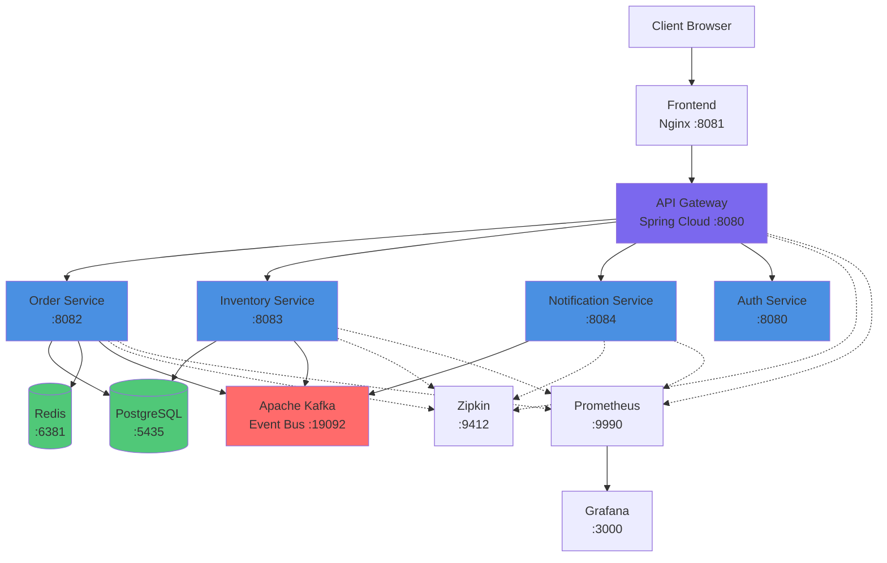

# Enterprise Order Management System

A production-ready microservices-based order management system built with Spring Boot, demonstrating modern backend architecture patterns and best practices.

> **Part of a portfolio showcasing event-driven architectures** - Also check out [CivicPulse](https://github.com/iam-ssrivastav/civic-pulse), an AI-powered smart city system using the same Kafka + Spring Boot stack with local LLM integration.


## 🏗️ Architecture Overview

This project implements a **microservices architecture** with event-driven communication using Apache Kafka, demonstrating enterprise-level design patterns and best practices.

### Architecture Diagram


### Component Flow




## ✨ Key Features

### Microservices Architecture
- **API Gateway**: Centralized entry point with routing and authentication
- **Order Service**: Order lifecycle management with circuit breaker pattern
- **Inventory Service**: Stock management with event-driven updates
- **Notification Service**: Asynchronous notification processing

### Event-Driven Communication
- **Apache Kafka**: Asynchronous messaging between services
- **Event Sourcing**: Order events published and consumed by multiple services
- **Loose Coupling**: Services communicate through events, not direct calls

### Design Patterns & Best Practices
- ✅ **Circuit Breaker** (Resilience4j) - Fault tolerance
- ✅ **API Gateway** Pattern - Centralized routing
- ✅ **Event-Driven Architecture** - Async communication
- ✅ **CQRS** - Command Query Responsibility Segregation
- ✅ **Repository Pattern** - Data access abstraction
- ✅ **DTO Pattern** - Data transfer objects
- ✅ **Builder Pattern** - Object construction

### Security
- 🔐 **JWT Authentication** - Token-based security
- 🔐 **CORS Configuration** - Cross-origin resource sharing
- 🔐 **Password Encryption** - Secure credential storage

### Data Management
- 💾 **PostgreSQL** - Relational database for persistence
- 💾 **Redis** - Caching layer for performance
- 💾 **Flyway** - Database migration management

### Monitoring & Observability
- 📊 **Prometheus** - Metrics collection
- 📊 **Grafana** - Metrics visualization
- 📊 **Zipkin** - Distributed tracing
- 📊 **Spring Actuator** - Health checks and metrics

### Frontend
- 🎨 **Modern UI** - Dark theme with glassmorphic design
- 🎨 **Responsive** - Mobile-friendly interface
- 🎨 **Real-time Updates** - Dynamic order management

## 🚀 Quick Start

### Prerequisites

- Java 17+
- Maven 3.8+
- Docker & Docker Compose
- Git

### 1. Clone the Repository

```bash
git clone https://github.com/YOUR_USERNAME/order-management-system.git
cd order-management-system
```

### 2. Start Infrastructure (Docker)

```bash
docker-compose up -d
```

This starts:
- Kafka & Zookeeper
- PostgreSQL
- Redis
- Prometheus, Grafana, Zipkin
- Frontend (Nginx)

### 3. Build All Services

```bash
mvn clean package -DskipTests
```

### 4. Start Microservices

Open 4 terminal windows and run:

```bash
# Terminal 1 - API Gateway
cd api-gateway
mvn spring-boot:run -Dspring-boot.run.jvmArguments="-Dserver.port=8080"

# Terminal 2 - Order Service
cd order-service
mvn spring-boot:run

# Terminal 3 - Inventory Service
cd inventory-service
mvn spring-boot:run

# Terminal 4 - Notification Service
cd notification-service
mvn spring-boot:run
```

### 5. Verify System

Run the end-to-end test script:

```bash
./test-e2e.sh
```

Expected output:
```
✓ API Gateway (port 8080): UP
✓ Order Service (port 8082): UP
✓ Inventory Service (port 8083): UP
✓ Notification Service (port 8084): UP
```

## 🌐 Access Points

| Service | URL | Credentials |
|---------|-----|-------------|
| **Frontend** | http://localhost:8081 | Any username |
| **API Gateway** | http://localhost:8080 | - |
| **Prometheus** | http://localhost:9990 | - |
| **Grafana** | http://localhost:3000 | admin/admin |
| **Zipkin** | http://localhost:9412 | - |

## 📖 API Documentation

### Authentication

**Login**
```bash
curl -X POST "http://localhost:8080/auth/login?username=testuser"
```

Response:
```json
"eyJhbGciOiJIUzI1NiJ9.eyJzdWIiOiJ0ZXN0dXNlciIsImlhdCI6MTcwMDAwMDAwMCwiZXhwIjoxNzAwMDAzNjAwfQ..."
```

### Orders

**Create Order**
```bash
curl -X POST http://localhost:8080/api/orders \
  -H "Content-Type: application/json" \
  -H "Authorization: Bearer YOUR_JWT_TOKEN" \
  -d '{
    "productId": "LAPTOP-001",
    "quantity": 2,
    "price": 1200.00,
    "customerId": "testuser"
  }'
```

**Get Order by ID**
```bash
curl -X GET http://localhost:8080/api/orders/1 \
  -H "Authorization: Bearer YOUR_JWT_TOKEN"
```

**Get Customer Orders**
```bash
curl -X GET http://localhost:8080/api/orders/customer/testuser \
  -H "Authorization: Bearer YOUR_JWT_TOKEN"
```

### Inventory

**Check Stock**
```bash
curl -X GET http://localhost:8080/api/inventory/LAPTOP-001
```

**Update Stock**
```bash
curl -X PUT http://localhost:8080/api/inventory/LAPTOP-001 \
  -H "Content-Type: application/json" \
  -d '{"quantity": 100}'
```

## 🏛️ Project Structure

```
order-management-system/
├── api-gateway/              # API Gateway service
│   └── src/main/java/com/enterprise/gateway/
│       ├── filter/          # Authentication filters
│       ├── controller/      # Auth endpoints
│       └── util/           # JWT utilities
├── order-service/           # Order management service
│   └── src/main/java/com/enterprise/order/
│       ├── controller/     # REST controllers
│       ├── service/        # Business logic
│       ├── repository/     # Data access
│       ├── entity/         # JPA entities
│       ├── dto/           # Data transfer objects
│       └── kafka/         # Kafka producers
├── inventory-service/       # Inventory management service
│   └── src/main/java/com/enterprise/inventory/
│       ├── service/       # Business logic
│       ├── kafka/         # Kafka consumers
│       └── repository/    # Data access
├── notification-service/    # Notification service
│   └── src/main/java/com/enterprise/notification/
│       ├── service/       # Notification logic
│       └── kafka/         # Kafka consumers
├── frontend/               # Web UI
│   ├── index.html
│   ├── style.css
│   ├── app.js
│   └── nginx.conf
├── monitoring/             # Monitoring configs
│   ├── prometheus/
│   └── grafana/
├── docker-compose.yml      # Infrastructure setup
└── test-e2e.sh            # End-to-end test script
```

## 🔧 Configuration

### Port Configuration

| Service | Port | Description |
|---------|------|-------------|
| Frontend | 8081 | Web UI |
| API Gateway | 8080 | Entry point |
| Order Service | 8082 | Order management |
| Inventory Service | 8083 | Stock management |
| Notification Service | 8084 | Notifications |
| Kafka | 19092 | Message broker |
| PostgreSQL | 5435 | Database |
| Redis | 6381 | Cache |
| Prometheus | 9990 | Metrics |
| Grafana | 3000 | Dashboards |
| Zipkin | 9412 | Tracing |
| Zookeeper | 12181 | Kafka coordination |

### Environment Variables

Each service can be configured via `application.yml`:

```yaml
spring:
  datasource:
    url: jdbc:postgresql://localhost:5435/order_db
    username: admin
    password: password
  kafka:
    bootstrap-servers: localhost:19092
  data:
    redis:
      host: localhost
      port: 6381
```

## 🧪 Testing

### Run Unit Tests
```bash
mvn test
```

### Run Integration Tests
```bash
mvn verify
```

### End-to-End Testing
```bash
./test-e2e.sh
```

## 📊 Monitoring

### Prometheus Metrics
Access metrics at: http://localhost:9990

Available metrics:
- HTTP request rates
- Response times
- Error rates
- JVM metrics (heap, threads, GC)
- Custom business metrics

### Grafana Dashboards
Access dashboards at: http://localhost:3000 (admin/admin)

Pre-configured dashboards:
- Service health overview
- Request throughput
- Error trends
- JVM monitoring

### Distributed Tracing
Access Zipkin at: http://localhost:9412

Trace requests across all microservices to identify bottlenecks.

## 🔄 Event Flow

### Order Placement Flow

1. **User** submits order via Frontend
2. **API Gateway** validates JWT and routes to Order Service
3. **Order Service**:
   - Saves order to PostgreSQL
   - Caches in Redis
   - Publishes `order-events` to Kafka
4. **Kafka** distributes event to subscribers
5. **Inventory Service**:
   - Consumes event
   - Updates stock levels
6. **Notification Service**:
   - Consumes event
   - Sends notification to customer

## 🛡️ Resilience Patterns

### Circuit Breaker
```yaml
resilience4j:
  circuitbreaker:
    instances:
      inventory:
        slidingWindowSize: 10
        failureRateThreshold: 50
        waitDurationInOpenState: 5s
```

### Retry Pattern
Automatic retries for transient failures with exponential backoff.

### Fallback Methods
Graceful degradation when services are unavailable.

## 🚧 Troubleshooting

### Services Won't Start

**Check port conflicts:**
```bash
lsof -i :8080 -i :8082 -i :8083 -i :8084
```

**Verify Docker containers:**
```bash
docker ps
```

### Kafka Connection Issues

**Check Kafka status:**
```bash
docker logs kafka
```

**Verify Kafka topics:**
```bash
docker exec kafka kafka-topics --list --bootstrap-server localhost:9092
```

### Database Connection Issues

**Check PostgreSQL:**
```bash
docker exec postgres psql -U admin -d order_db -c "SELECT 1;"
```

## 📝 Development

### Adding a New Service

1. Create new Maven module
2. Add Spring Boot dependencies
3. Configure in `docker-compose.yml`
4. Update API Gateway routes
5. Add Kafka listeners if needed

### Database Migrations

Using Flyway for version control:

```sql
-- V1__create_orders_table.sql
CREATE TABLE orders (
    id BIGSERIAL PRIMARY KEY,
    product_id VARCHAR(255) NOT NULL,
    quantity INTEGER NOT NULL,
    ...
);
```

## 🤝 Contributing

1. Fork the repository
2. Create a feature branch (`git checkout -b feature/amazing-feature`)
3. Commit your changes (`git commit -m 'Add amazing feature'`)
4. Push to the branch (`git push origin feature/amazing-feature`)
5. Open a Pull Request

## 📄 License

This project is licensed under the MIT License - see the LICENSE file for details.

## 🙏 Acknowledgments

- Spring Boot team for the excellent framework
- Apache Kafka for reliable messaging
- Resilience4j for fault tolerance patterns
- The open-source community

## 🔗 Related Projects

### 🏙️ [CivicPulse - Smart City Incident Triage System](https://github.com/iam-ssrivastav/civic-pulse)

A complementary project showcasing **AI-powered event-driven architecture** for smart cities.

**Key Highlights:**
- 🤖 **Local AI Integration** - Uses Ollama (Llama3) for automatic incident categorization
- ⚡ **Real-time Processing** - Apache Kafka for event streaming (similar to this project)
- 🔒 **Privacy-First** - 100% local processing, zero cloud costs
- 💰 **Cost Savings** - Saves cities $60,000+/year vs cloud AI solutions
- 📊 **Live Dashboard** - Real-time incident tracking and analysis

**Tech Stack:** Spring Boot, Spring AI, Apache Kafka, PostgreSQL, Ollama

**Use Case:** Citizens report city issues (potholes, broken lights, etc.), and AI automatically categorizes and prioritizes them in seconds.

> 💡 **Perfect companion project** to learn how to integrate AI with event-driven microservices!

---

**Other Projects:**
- 📋 [TaskFlow](https://github.com/iam-ssrivastav/taskflow-app) - Modern task management with WebSockets
- 🎯 [System Design Demo](https://github.com/iam-ssrivastav/system-design-demo) - Design patterns showcase

## 📧 Contact

For questions or support, please open an issue on GitHub.

---

**Built with ❤️ using Spring Boot, Kafka, and modern microservices patterns**
