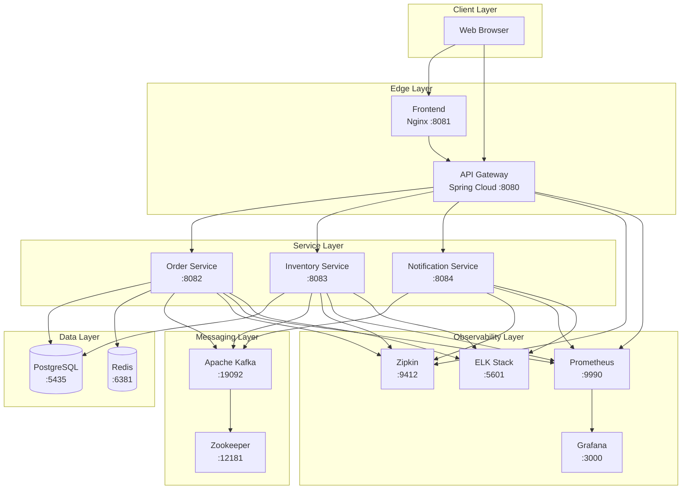
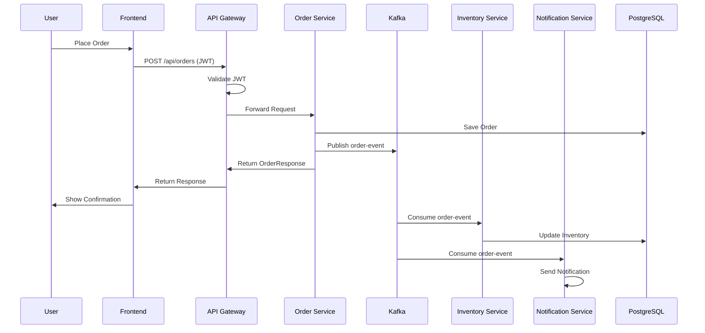
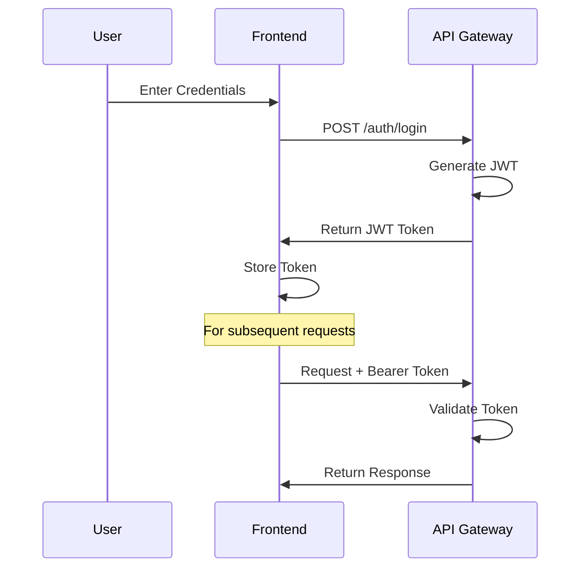

# System Architecture Documentation

## Table of Contents
1. [Architecture Overview](#architecture-overview)
2. [System Components](#system-components)
3. [Data Flow](#data-flow)
4. [Technology Stack](#technology-stack)
5. [Design Patterns](#design-patterns)
6. [Security Architecture](#security-architecture)
7. [Scalability & Performance](#scalability--performance)

---

## Architecture Overview

The Order Management System follows a **microservices architecture** with event-driven communication patterns. Services are loosely coupled, independently deployable, and communicate asynchronously through Apache Kafka.

### High-Level Architecture



---

## System Components

### 1. API Gateway (Port 8080)

**Responsibilities:**
- Single entry point for all client requests
- Request routing to appropriate microservices
- JWT token validation and authentication
- CORS configuration
- Rate limiting (future enhancement)
- Load balancing

**Technology:**
- Spring Cloud Gateway
- Spring Security
- JWT (jsonwebtoken)

**Key Features:**
```java
// Route Configuration
routes:
  - id: order-service
    uri: http://localhost:8082
    predicates:
      - Path=/api/orders/**
    filters:
      - AuthenticationFilter
```

**Endpoints:**
- `POST /auth/login` - Generate JWT token
- `/api/orders/**` - Route to Order Service
- `/api/inventory/**` - Route to Inventory Service
- `/api/notifications/**` - Route to Notification Service

---

### 2. Order Service (Port 8082)

**Responsibilities:**
- Order creation and management
- Order lifecycle tracking
- Event publishing to Kafka
- Caching frequently accessed orders
- Circuit breaker for fault tolerance

**Technology:**
- Spring Boot
- Spring Data JPA
- Spring Kafka
- Resilience4j
- Redis (caching)

**Database Schema:**
```sql
CREATE TABLE orders (
    id BIGSERIAL PRIMARY KEY,
    product_id VARCHAR(255) NOT NULL,
    quantity INTEGER NOT NULL,
    price DECIMAL(10,2) NOT NULL,
    customer_id VARCHAR(255) NOT NULL,
    status VARCHAR(50) NOT NULL,
    created_at TIMESTAMP NOT NULL,
    updated_at TIMESTAMP NOT NULL
);
```

**Event Publishing:**
```java
// Publishes to "order-events" topic
OrderResponse orderResponse = mapToOrderResponse(order);
kafkaTemplate.send("order-events", orderResponse);
```

---

### 3. Inventory Service (Port 8083)

**Responsibilities:**
- Inventory stock management
- Product availability checking
- Stock deduction based on orders
- Event consumption from Kafka

**Technology:**
- Spring Boot
- Spring Data JPA
- Spring Kafka
- Flyway (migrations)

**Database Schema:**
```sql
CREATE TABLE inventory (
    id BIGSERIAL PRIMARY KEY,
    product_id VARCHAR(255) UNIQUE NOT NULL,
    product_name VARCHAR(255) NOT NULL,
    quantity INTEGER NOT NULL,
    created_at TIMESTAMP NOT NULL,
    updated_at TIMESTAMP NOT NULL
);
```

**Event Consumption:**
```java
@KafkaListener(topics = "order-events", groupId = "inventory-group")
public void consumeOrderEvent(String message) {
    // Process order and update inventory
    inventoryService.deductStock(productId, quantity);
}
```

---

### 4. Notification Service (Port 8084)

**Responsibilities:**
- Send order confirmation notifications
- Email/SMS notification (simulated)
- Notification history tracking
- Event consumption from Kafka

**Technology:**
- Spring Boot
- Spring Kafka
- Jackson (JSON processing)

**Event Consumption:**
```java
@KafkaListener(topics = "order-events", groupId = "notification-group")
public void consumeOrderEvent(String message) {
    // Send notification to customer
    notificationService.sendNotification(orderId, customerId);
}
```

---

### 5. ELK Stack (Observability)

**Components:**
- **Elasticsearch (Port 9200):** Distributed search and analytics engine.
- **Logstash (Port 5000):** Server-side data processing pipeline.
- **Kibana (Port 5601):** Data visualization dashboard.

**Log Flow:**
1. Microservices send logs via TCP to Logstash.
2. Logstash processes and indexes logs into Elasticsearch.
3. Kibana queries Elasticsearch to visualize logs.

---

## Data Flow

### Order Placement Flow



### Authentication Flow



---

## Technology Stack

### Backend Services
| Technology | Version | Purpose |
|------------|---------|---------|
| Java | 17 | Programming language |
| Spring Boot | 3.2.0 | Application framework |
| Spring Cloud Gateway | 4.1.0 | API Gateway |
| Spring Data JPA | 3.2.0 | Data persistence |
| Spring Kafka | 3.1.0 | Event streaming |
| Resilience4j | 2.1.0 | Circuit breaker |

### Infrastructure
| Technology | Version | Purpose |
|------------|---------|---------|
| Apache Kafka | 7.5.0 | Message broker |
| PostgreSQL | 15 | Relational database |
| Redis | 7 | Caching layer |
| Zookeeper | 7.5.0 | Kafka coordination |

### Monitoring
| Technology | Version | Purpose |
|------------|---------|---------|
| Prometheus | Latest | Metrics collection |
| Grafana | Latest | Metrics visualization |
| Zipkin | Latest | Distributed tracing |
| Spring Actuator | 3.2.0 | Health checks |

### Frontend
| Technology | Purpose |
|------------|---------|
| HTML5 | Structure |
| CSS3 | Styling |
| JavaScript (ES6+) | Interactivity |
| Nginx | Web server |

---

## Design Patterns

### 1. API Gateway Pattern
**Purpose:** Single entry point for all client requests

**Benefits:**
- Centralized authentication
- Request routing
- Protocol translation
- Load balancing

### 2. Event-Driven Architecture
**Purpose:** Asynchronous communication between services

**Benefits:**
- Loose coupling
- Scalability
- Resilience
- Temporal decoupling

### 3. Circuit Breaker Pattern
**Purpose:** Prevent cascading failures

**Implementation:**
```yaml
resilience4j:
  circuitbreaker:
    instances:
      inventory:
        slidingWindowSize: 10
        failureRateThreshold: 50
        waitDurationInOpenState: 5s
```

**States:**
- **Closed:** Normal operation
- **Open:** Failures detected, requests fail fast
- **Half-Open:** Testing if service recovered

### 4. Repository Pattern
**Purpose:** Abstract data access logic

**Benefits:**
- Separation of concerns
- Testability
- Maintainability

### 5. DTO Pattern
**Purpose:** Data transfer between layers

**Benefits:**
- Decoupling domain from API
- Validation
- Versioning

### 6. CQRS (Command Query Responsibility Segregation)
**Purpose:** Separate read and write operations

**Implementation:**
- Commands: Order creation (writes)
- Queries: Order retrieval (reads with caching)

---

## Security Architecture

### Authentication & Authorization

**JWT Token Flow:**
```
1. User logs in → API Gateway generates JWT
2. JWT contains: subject, issued time, expiration
3. Client includes JWT in Authorization header
4. Gateway validates JWT on each request
5. Valid token → route to service
6. Invalid/expired → 401 Unauthorized
```

**JWT Structure:**
```json
{
  "header": {
    "alg": "HS256",
    "typ": "JWT"
  },
  "payload": {
    "sub": "username",
    "iat": 1700000000,
    "exp": 1700003600
  },
  "signature": "..."
}
```

### CORS Configuration
```java
corsConfig.setAllowedOrigins(Collections.singletonList("*"));
corsConfig.setAllowedMethods(Arrays.asList("GET", "POST", "PUT", "DELETE"));
corsConfig.setAllowedHeaders(Arrays.asList("Content-Type", "Authorization"));
```

### Database Security
- Connection pooling with HikariCP
- Prepared statements (SQL injection prevention)
- Encrypted passwords in configuration
- Database user with minimal privileges

---

## Scalability & Performance

### Horizontal Scaling
Each microservice can be scaled independently:
```bash
# Scale Order Service to 3 instances
docker-compose up --scale order-service=3
```

### Caching Strategy
**Redis Caching:**
- Cache frequently accessed orders
- TTL: 1 hour
- Cache invalidation on updates

```java
@Cacheable(value = "orders", key = "#orderId")
public OrderResponse getOrder(Long orderId) {
    // Database query only on cache miss
}
```

### Database Optimization
- Indexed columns: `product_id`, `customer_id`, `created_at`
- Connection pooling (max 20 connections)
- Read replicas (future enhancement)

### Kafka Performance
- Partitioning for parallel processing
- Consumer groups for load distribution
- Batch processing for efficiency

### Load Balancing
API Gateway distributes requests across service instances:
```yaml
spring:
  cloud:
    gateway:
      routes:
        - id: order-service
          uri: lb://order-service  # Load balanced
```

---

## Deployment Architecture

### Docker Compose (Development)
```yaml
services:
  - kafka (1 broker)
  - zookeeper
  - postgresql
  - redis
  - prometheus
  - grafana
  - zipkin
  - frontend
```

### Production Considerations
- **Kubernetes:** Container orchestration
- **Multiple Kafka brokers:** High availability
- **Database clustering:** PostgreSQL HA
- **Redis Sentinel:** Cache redundancy
- **CDN:** Frontend static assets
- **API Gateway clustering:** Load distribution

---

## Monitoring & Observability

### Metrics (Prometheus)
- Request rate (requests/second)
- Error rate (%)
- Response time (p50, p95, p99)
- JVM metrics (heap, GC, threads)
- Custom business metrics

### Dashboards (Grafana)
- Service health overview
- Request throughput
- Error trends
- Database connection pool
- Kafka lag monitoring

### Distributed Tracing (Zipkin)
- End-to-end request tracking
- Service dependency mapping
- Latency analysis
- Latency analysis
- Error investigation

### Centralized Logging (ELK)
- **Log Aggregation:** All service logs in one place
- **Real-time Analysis:** View logs as they happen
- **Search & Filter:** Query logs by trace ID, service, or error level

### Health Checks
```bash
# Service health
GET /actuator/health

# Detailed metrics
GET /actuator/metrics
GET /actuator/prometheus
```

---

## Future Enhancements

### Short Term
- [ ] Add Swagger/OpenAPI documentation
- [ ] Implement rate limiting
- [ ] Add request validation
- [ ] Enhance error handling

### Medium Term
- [ ] Implement SAGA pattern for distributed transactions
- [ ] Add service mesh (Istio)
- [ ] Implement API versioning
- [ ] Add comprehensive test suite

### Long Term
- [ ] Kubernetes deployment
- [ ] Multi-region deployment
- [ ] Kubernetes deployment
- [ ] Multi-region deployment
- [ ] Machine learning for demand forecasting
- [ ] Machine learning for demand forecasting

---

## Conclusion

This architecture provides:
- ✅ **Scalability** through microservices
- ✅ **Resilience** through circuit breakers
- ✅ **Performance** through caching
- ✅ **Observability** through monitoring
- ✅ **Maintainability** through clean separation

The system is production-ready and demonstrates enterprise-level design patterns and best practices.
